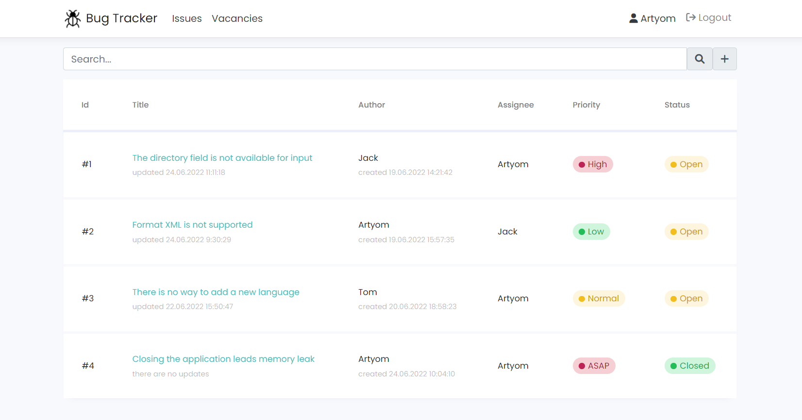

# :bug: Bug Tracking System

A simple bug tracker that helps you manage bugs easily. It's a web-based application and general purpose issue tracking application. The application is developed on **ASP.NET Core MVC**.

### Functionality
- The user can register, log in and log out of the system.
- The user can create, view, edit and delete issues. 
  - The issue contains the title, description, date of creation and date of the last edit (set automatically when created and modified accordingly), author, assignee, priority (ASAP, High, Low, Normal), as well as its status (Open, Closed).
  - When assigning a user to an issue (when creating or editing), the assignee is notified by email.
- The user can close/reopen issues.
- The user can search issues.
- The user can view vacancies.

> **Note**
> This project was developed as part of my technological practice. So in addition to the business (domain) requirements the project has [general technical requirements](#Requirements).

### Requirements
| #  | Requirement                                          | Implementation details                                                                                                                                    |    Implemented?    |
|--- |------------------------------------------------------|-----------------------------------------------------------------------------------------------------------------------------------------------------------|:------------------:|
| 1  | Dependency injection                                 | Used the built-in ASP.NET Core dependency container.                                                                                                      | :heavy_check_mark: |
| 2  | Working with the database (CRUD, Repository pattern) | Used the **MySQL** relational DBMS. CRUD operations on database objects are implemented. **Repository pattern** was also implemented.                     | :heavy_check_mark: |
| 3  | Data mapping                                         | **Entity Framework Core** was used as an ORM.                                                                                                             | :heavy_check_mark: |
| 4  | Data validation                                      | Annotations from `System.ComponentModel.DataAnnotations` were used to validate the model. Own custom validation attributes were also used.                | :heavy_check_mark: |
| 5  | Logging                                              | Used the logger `ILogger<T>` from `Microsoft.Extensions.Logging`. Filters were also used for logging SQL queries.                                         | :heavy_check_mark: |
| 6  | Testing                                              | Unit tests for `BugTracker` are implemented using the **xUnit** testing framework. The isolation framework **Moq** was also used.                         | :heavy_check_mark: |          
| 7  | Integration with any HTTP service                    | Implemented integration with the public job service over HTTP via `HttpClient` from `System.Net.Http`. **Retry policy** was also implemented via `Polly`. | :heavy_check_mark: |
| 8  | Authentication                                       | Authentication is implemented using **Identity** and custom Razor pages.                                                                                  | :heavy_check_mark: |    
| 9  | Message queues                                       | A message queue using the **RabbitMQ** (AMQP protocol) was used to communicate with the microservice.                                                     | :heavy_check_mark: |   
| 10 | Microservices                                        | A mail (SMTP) microservice was implemented that notifies the user about assigment to the issue.                                                           | :heavy_check_mark: |